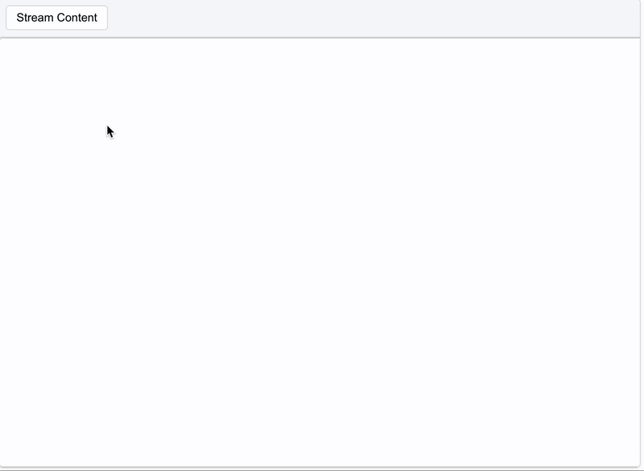

# Tiptap Stagger Extension

A Tiptap extension that adds staggered animation to text as it appears in the editor. Perfect for AI editors, chatbots, and anywhere you want to create a typewriter-like effect with more visual polish.



[](https://badge.fury.io/js/@10play%2Ftiptap-stagger)

## Features

- Adds staggered animations to text as it's added to the editor
- Works with both text nodes and block nodes
- Lightweight with minimal dependencies

## Installation

```bash
# Using npm
npm install @10play/tiptap-stagger

# Using yarn
yarn add @10play/tiptap-stagger

# Using bun
bun add @10play/tiptap-stagger
```

## Usage

### In React with @tiptap/react

```tsx
import "@10play/tiptap-stagger/styles.css"; // Import styles
import { StaggerExtension } from "@10play/tiptap-stagger";
import { useEditor, EditorContent } from "@tiptap/react";
import StarterKit from "@tiptap/starter-kit";

const Editor = () => {
  const editor = useEditor({
    extensions: [StarterKit, StaggerExtension],
    content: "<p>Hello World!</p>",
    editable: false, // Typically used in read-only mode for AI responses
  });

  return <EditorContent editor={editor} />;
};
```

### In Vue with @tiptap/vue-3

```vue
<script setup>
import "@10play/tiptap-stagger/styles.css"; // Import styles
import { StaggerExtension } from "@10play/tiptap-stagger";
import { useEditor, EditorContent } from "@tiptap/vue-3";
import StarterKit from "@tiptap/starter-kit";

const editor = useEditor({
  extensions: [StarterKit, StaggerExtension],
  content: "<p>Hello World!</p>",
  editable: false,
});
</script>

<template>
  <EditorContent :editor="editor" />
</template>
```

## Configuration

The StaggerExtension accepts the following configuration options:

```typescript
StaggerExtension.configure({
  enabled: true, // Enable or disable the stagger effect
  animation: "default", // Currently only 'default' is supported
});
```

You can also toggle the stagger effect on and off:

```typescript
// Enable stagger animation
editor.commands.setStaggerEnabled(true);

// Disable stagger animation
editor.commands.setStaggerEnabled(false);
```

## Demo

Check out the live demo on [GitHub Pages](https://10play.github.io/tiptap-stagger/) to see the stagger effect in action.

## Contributing

Contributions are welcome! Please feel free to submit a Pull Request.

## License

This project is licensed under the MIT License - see the LICENSE file for details.

Made with ❤️ by [10Play](https://www.10play.dev)
